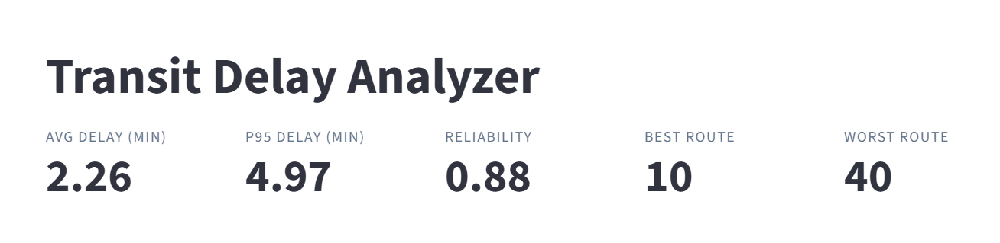

# Transit Delay Analyzer 🚍 

**Which bus routes are reliable, and how much does weather mess with them?**
An interactive dashboard built on a Python ETL pipeline that ingests GTFS schedule data, joins hourly weather, and surfaces daily reliability metrics per route.

🔗 **[Open the live demo →](https://transit-delay-analyzer.streamlit.app/)** &nbsp;·&nbsp; 📂 [Source on GitHub](https://github.com/ArpitaRaj27/transit-delay-analyzer-updated-)


---

## What you can do with it

- **Spot unreliable routes at a glance** - five live KPIs (avg delay, P95 delay, reliability score, best/worst route)
- **See trends over time** — per-route line charts and ranked bar charts for the last 7 days
- **Quantify weather impact** - scatter plot of daily precipitation vs. average delay
- **Pull the data** - filter by date and route, then download a CSV



---

## How it was built

I built this end-to-end, from raw data to deployed dashboard:

1. **Ingest** - load a sample GTFS feed (stops, trips, schedule) plus simulated arrival data and pull hourly weather observations
2. **Transform** - compute per-stop delays in SQL, clip outliers, then aggregate to daily route-level metrics including a 95th-percentile delay and a 0–1 reliability score
3. **Serve** - query the aggregates from a Streamlit app that handles filtering, charting, and CSV export

**Stack:** Python · pandas · SQL · Streamlit · PostgreSQL (local pipeline) · SQLite (deployed demo) · Docker

---

## Run it yourself

```bash
git clone https://github.com/ArpitaRaj27/transit-delay-analyzer-updated-.git
cd transit-delay-analyzer-updated-
pip install -r requirements.txt
streamlit run streamlit_app.py
```

Opens at `http://localhost:8501`. To rebuild the SQLite database from the source CSVs:

```bash
python build_db.py
```

---

## Project structure

```
streamlit_app.py    # Dashboard (SQLite-backed)
build_db.py         # Rebuilds data/transit.db from CSVs
requirements.txt
data/
  transit.db        # SQLite DB the app reads
  *.csv             # Source tables exported from the ETL pipeline
screenshots/        # Dashboard screenshots used in this README
```

> **Why two databases?** The full ETL runs on Postgres + Docker locally, the architecture I'd use in production. For the public demo I bundle the same aggregated data into a SQLite file so the app deploys for free on Streamlit Community Cloud with no DB server to manage.

---

## What I learned

- Designing an ETL pipeline that handles real-world messiness (missing data, time-zone math, outlier delays)
- Writing performant SQL, window functions, percentile aggregates, conditional joins
- Translating raw operational data into KPIs a non-technical user can read in 5 seconds
- Tradeoffs in deployment architecture (Postgres for the pipeline, SQLite for the demo)
